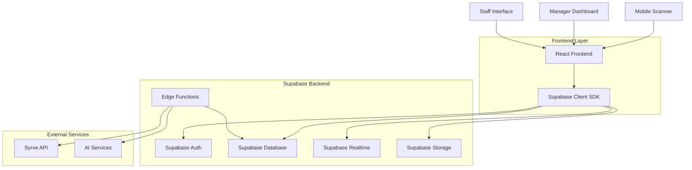
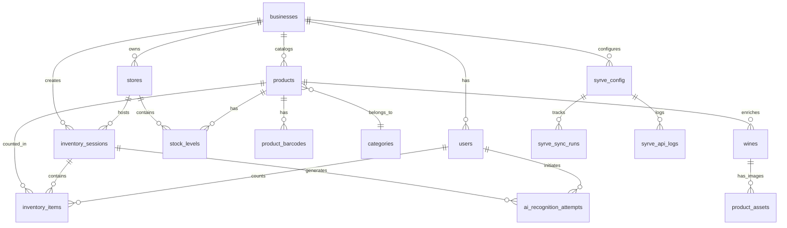
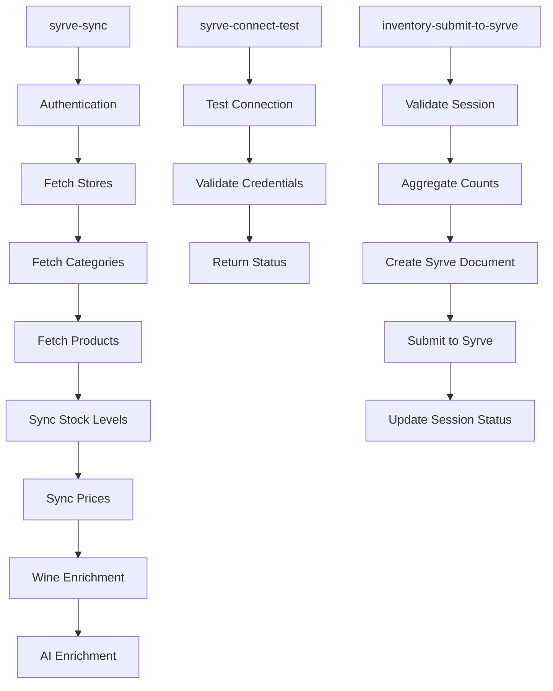
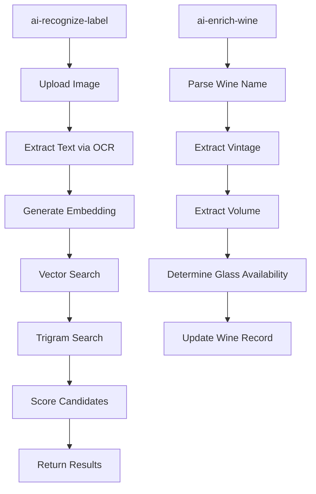
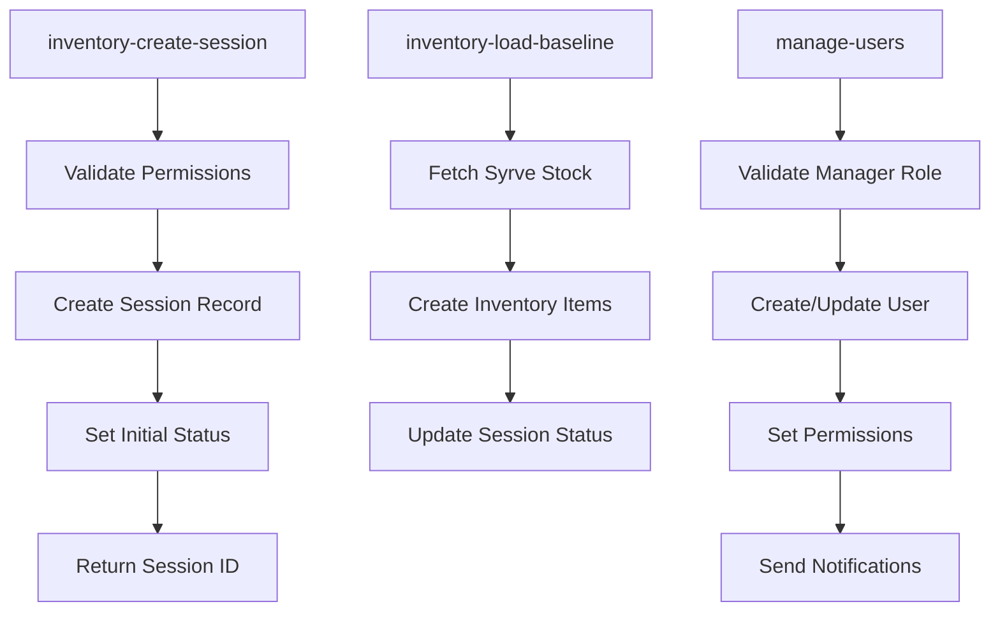
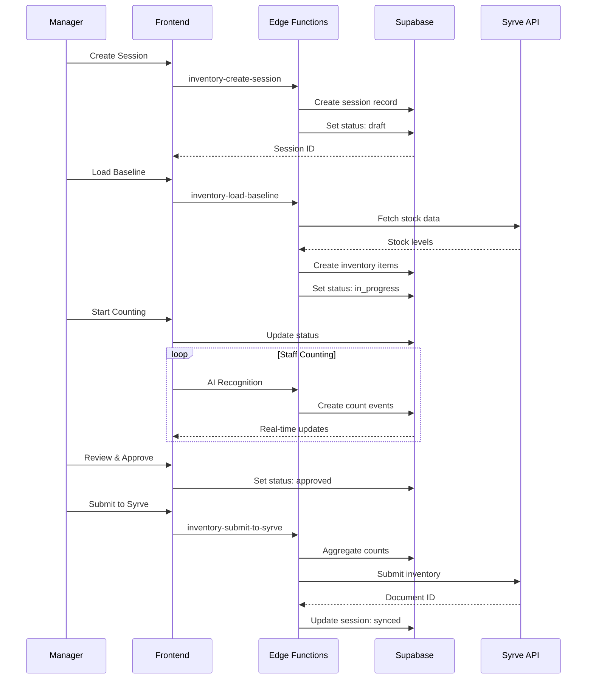
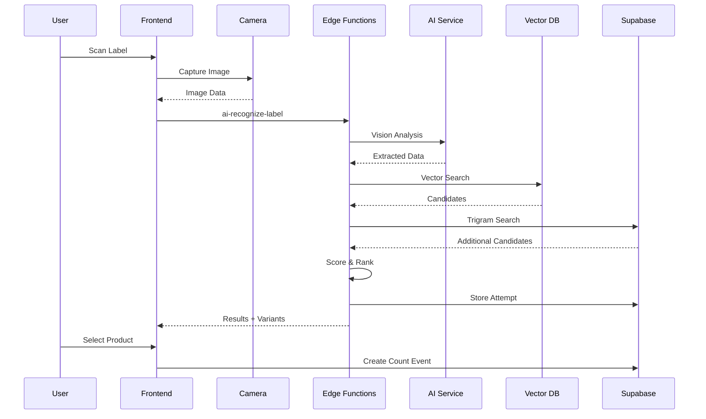

# Supabase Integration Architecture

## System Architecture Overview



## Technology Stack

### Frontend
- **React 18** with TypeScript
- **TanStack Query** for data fetching and caching
- **React Hook Form** for form management
- **Shadcn/UI** components
- **Zustand** for state management
- **React Scanner** for camera integration

### Backend (Supabase)
- **PostgreSQL 15** with pgvector extension
- **Edge Functions** (Deno runtime)
- **Row Level Security (RLS)** policies
- **Realtime subscriptions** via WebSocket
- **Storage buckets** for image assets

### External Integrations
- **Syrve Server API** for inventory data
- **Google Gemini** for AI label recognition
- **OpenAI Embeddings** for vector search
- **Lovable AI Gateway** for API aggregation

## Database Schema Architecture



## Edge Functions Architecture

### Core Functions

#### 1. Syrve Integration Functions


#### 2. AI Recognition Functions


#### 3. Inventory Management Functions


## Data Flow Architecture

### Inventory Session Lifecycle


### AI Recognition Flow


## Security Architecture

### Row Level Security (RLS)

#### Business Isolation
```sql
-- All tables have business_id for multi-tenancy
CREATE POLICY "Business isolation" ON products
  FOR ALL USING (business_id = current_business_id());

-- Function to get current business ID
CREATE OR REPLACE FUNCTION current_business_id()
RETURNS UUID AS $$
BEGIN
  RETURN NULLIF(current_setting('app.current_business_id', true), '')::UUID;
END;
$$ LANGUAGE plpgsql SECURITY DEFINER;
```

#### Role-Based Access
```sql
-- Manager can access all business data
CREATE POLICY "Manager access" ON inventory_sessions
  FOR ALL USING (
    business_id = current_business_id() 
    AND has_role('manager')
  );

-- Staff can only access active sessions
CREATE POLICY "Staff access" ON inventory_sessions
  FOR SELECT USING (
    business_id = current_business_id() 
    AND has_role('staff')
    AND status = 'in_progress'
  );
```

### API Security

#### Edge Function Authentication
```typescript
// Validate JWT token
const authHeader = req.headers.get("Authorization");
if (!authHeader?.startsWith("Bearer ")) {
  return new Response(JSON.stringify({ error: "Unauthorized" }), {
    status: 401,
    headers: { ...corsHeaders, "Content-Type": "application/json" },
  });
}

// Get user claims
const { data: claimsData, error: claimsError } = await supabaseUser.auth.getClaims(token);
if (claimsError || !claimsData?.claims) {
  return new Response(JSON.stringify({ error: "Unauthorized" }), {
    status: 401,
    headers: { ...corsHeaders, "Content-Type": "application/json" },
  });
}
```

#### Service Role Usage
```typescript
// Use service role for admin operations
const supabaseAdmin = createClient(
  Deno.env.get("SUPABASE_URL")!,
  Deno.env.get("SUPABASE_SERVICE_ROLE_KEY")!
);

// Set business context for RLS
await supabaseAdmin.rpc('set_business_context', {
  business_id: businessId
});
```

## Real-time Architecture

### WebSocket Connections
```typescript
// Real-time subscription setup
const channel = supabase
  .channel(`inventory:${sessionId}`)
  .on('postgres_changes', {
    event: '*',
    schema: 'public',
    table: 'inventory_items',
    filter: `session_id=eq.${sessionId}`
  }, (payload) => {
    queryClient.invalidateQueries(['inventory_items', sessionId]);
  })
  .subscribe();
```

### Presence Tracking
```typescript
// User presence in inventory sessions
const presenceChannel = supabase.channel(`presence:${sessionId}`);

presenceChannel
  .on('presence', { event: 'sync' }, () => {
    const state = presenceChannel.presenceState();
    setActiveUsers(Object.values(state).flat());
  })
  .subscribe(async (status) => {
    if (status === 'SUBSCRIBED') {
      await presenceChannel.track({
        user_id: user.id,
        user_name: user.name,
        role: user.role,
        last_activity: new Date().toISOString()
      });
    }
  });
```

## Performance Optimization

### Database Indexing
```sql
-- Core indexes for performance
CREATE INDEX idx_products_business_id ON products(business_id);
CREATE INDEX idx_products_name_trgm ON products USING gin(name gin_trgm_ops);
CREATE INDEX idx_stock_levels_product_store ON stock_levels(product_id, store_id);
CREATE INDEX idx_inventory_items_session_id ON inventory_items(session_id);
CREATE INDEX idx_ai_recognition_attempts_user_id ON ai_recognition_attempts(user_id);

-- Composite indexes for common queries
CREATE INDEX idx_inventory_sessions_business_status ON inventory_sessions(business_id, status);
CREATE INDEX idx_products_category_active ON products(category_id, is_active) WHERE is_deleted = false;
```

### Query Optimization
```typescript
// Batch operations for better performance
const BATCH_SIZE = 50;
for (let i = 0; i < items.length; i += BATCH_SIZE) {
  const batch = items.slice(i, i + BATCH_SIZE);
  await supabase.from('table').upsert(batch);
}

// Use database functions for complex operations
const { data } = await supabase
  .rpc('get_stock_summary', {
    product_ids: productIds,
    store_ids: storeIds
  });
```

### Caching Strategy
```typescript
// TanStack Query configuration
const queryClient = new QueryClient({
  defaultOptions: {
    queries: {
      staleTime: 5 * 60 * 1000, // 5 minutes
      cacheTime: 10 * 60 * 1000, // 10 minutes
      retry: 3,
      retryDelay: attemptIndex => Math.min(1000 * 2 ** attemptIndex, 30000),
    },
  },
});
```

## Monitoring & Observability

### Audit Logging
```sql
-- Central audit log table
CREATE TABLE audit_logs (
  id UUID PRIMARY KEY DEFAULT gen_random_uuid(),
  business_id UUID REFERENCES businesses(id),
  user_id UUID REFERENCES users(id),
  action_type TEXT NOT NULL,
  entity_type TEXT,
  entity_id UUID,
  metadata JSONB,
  error_message TEXT,
  created_at TIMESTAMPTZ DEFAULT NOW()
);

-- Indexes for audit log queries
CREATE INDEX idx_audit_logs_business_created ON audit_logs(business_id, created_at DESC);
CREATE INDEX idx_audit_logs_user_created ON audit_logs(user_id, created_at DESC);
```

### Performance Metrics
```typescript
// Track function execution time
const startTime = Date.now();
try {
  // Function logic
  const duration = Date.now() - startTime;
  
  await supabaseAdmin.from('performance_metrics').insert({
    function_name: 'function_name',
    duration_ms: duration,
    status: 'success',
    business_id: businessId
  });
} catch (error) {
  const duration = Date.now() - startTime;
  
  await supabaseAdmin.from('performance_metrics').insert({
    function_name: 'function_name',
    duration_ms: duration,
    status: 'error',
    error_message: error.message,
    business_id: businessId
  });
}
```

## Deployment Architecture

### Infrastructure Components
```yaml
# Supabase Configuration
project:
  name: wine-inventory-platform
  region: us-east-1
  
database:
  version: "15"
  extensions:
    - pgvector
    - pg_trgm
    - pgcrypto
    
edge_functions:
  runtime: "deno"
  memory: "512MB"
  timeout: "60s"
  
realtime:
  enabled: true
  max_connections: 200
  
storage:
  buckets:
    - name: "product-images"
      public: false
    - name: "ai-labels"
      public: false
```

### Environment Configuration
```bash
# Production Environment Variables
SUPABASE_URL=https://your-project.supabase.co
SUPABASE_ANON_KEY=your-anon-key
SUPABASE_SERVICE_ROLE_KEY=your-service-role-key

# Syrve Integration
SYRVE_ENCRYPTION_KEY=your-encryption-key

# AI Services
LOVABLE_API_KEY=your-lovable-api-key
OPENAI_API_KEY=your-openai-key
GEMINI_API_KEY=your-gemini-key

# Monitoring
SENTRY_DSN=your-sentry-dsn
LOG_LEVEL=info
```

This architecture ensures scalable, secure, and performant integration with Supabase while maintaining real-time capabilities and robust error handling.