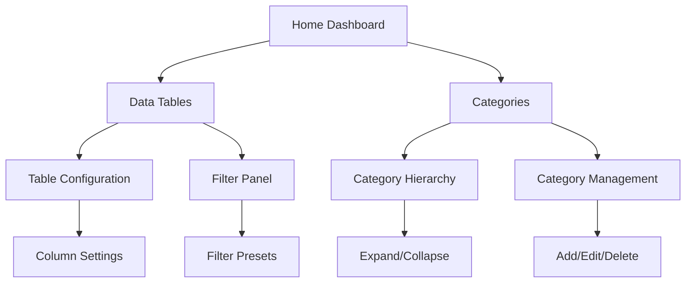

## 1. Product Overview
This document outlines comprehensive UI/UX improvements for the existing application, focusing on enhanced table functionality, layout optimization, and visual hierarchy improvements. The goal is to create a more professional, compact, and user-friendly interface with improved data visualization and navigation.

The improvements target better user experience through structured layouts, configurable table columns, advanced filtering capabilities, and expandable category hierarchies while maintaining a clean, modern design aesthetic.

## 2. Core Features

### 2.1 User Roles
| Role | Registration Method | Core Permissions |
|------|---------------------|------------------|
| Regular User | Email registration | View tables, use filters, configure column visibility |
| Admin User | Admin panel assignment | Full table management, category hierarchy management |

### 2.2 Feature Module
The UI/UX improvements consist of the following main components:
1. **Enhanced Tables**: Configurable columns, advanced filters, compact design
2. **Layout Optimization**: Structured layouts, compact typography, improved sidebar
3. **Category Management**: Expandable hierarchical categories with visual hierarchy
4. **General UI Improvements**: Consistent styling, better visual hierarchy, responsive design

### 2.3 Page Details
| Page Name | Module Name | Feature description |
|-----------|-------------|---------------------|
| Data Tables | Table Configuration | Show/hide columns, reorder columns, resize column widths, save column preferences |
| Data Tables | Advanced Filtering | Multi-column filters, filter presets, quick filter toolbar, filter history |
| Data Tables | Table Display | Compact row spacing, zebra striping, hover effects, sortable headers |
| Categories | Hierarchy View | Expandable tree structure, nested categories, visual indentation, collapse/expand all |
| Categories | Category Management | Add/edit/delete categories, drag-and-drop reordering, bulk operations |
| Layout | Sidebar Navigation | Collapsible sidebar, icon-based navigation, compact menu items, active state indicators |
| Layout | Typography | Reduced font sizes (12-14px for body), consistent heading hierarchy, improved readability |
| Layout | Spacing | Reduced padding/margins, efficient use of whitespace, grid-based layout system |
| General | Responsive Design | Mobile-adaptive layouts, touch-friendly controls, breakpoint optimization |
| General | Visual Consistency | Unified color scheme, consistent button styles, standardized form controls |

## 3. Core Process
**Regular User Flow:**
1. User accesses main dashboard with improved layout
2. Views data tables with configurable columns and filters
3. Navigates through expandable category hierarchies
4. Customizes table view preferences (saved locally)

**Admin User Flow:**
1. Admin accesses category management interface
2. Creates/modifies category hierarchies with drag-and-drop
3. Configures table defaults for all users
4. Manages system-wide UI preferences

## 4. User Interface Design

### 4.1 Design Style
- **Primary Colors**: Professional blue (#2563eb) for primary actions, gray (#6b7280) for secondary elements
- **Secondary Colors**: Light gray (#f3f4f6) for backgrounds, white for cards/content areas
- **Button Style**: Rounded corners (4px), subtle shadows, consistent height (32px for compact, 40px for regular)
- **Typography**: Inter font family, 12-14px body text, hierarchical heading sizes (16px, 20px, 24px)
- **Layout Style**: Card-based with grid system, top navigation with collapsible sidebar
- **Icon Style**: Feather icons or similar minimalist set, consistent 16px size for UI elements

### 4.2 Page Design Overview
| Page Name | Module Name | UI Elements |
| Main Dashboard | Layout Container | Full-width container, 12-column grid, 16px base spacing |
| Data Tables | Table Header | Compact header (48px height), action buttons left-aligned, view controls right-aligned |
| Data Tables | Table Body | Row height 32px, zebra striping, hover background #f9fafb, sort indicators in headers |
| Data Tables | Filter Bar | Collapsible filter panel, chip-based active filters, clear all button |
| Categories | Tree View | Indentation 24px per level, expand/collapse icons, folder/file indicators |
| Categories | Action Buttons | Small 24px square buttons, icon-only with tooltips, consistent spacing |
| Sidebar | Navigation | Width 240px (collapsible to 64px), icon + text menu items, active item highlighting |
| Sidebar | User Section | Compact 48px height, avatar + username, dropdown menu trigger |

### 4.3 Responsiveness
- **Desktop-first approach**: Optimized for 1920x1080 and 1366x768 resolutions
- **Tablet adaptation**: Sidebar collapses to icons-only, tables become horizontally scrollable
- **Mobile optimization**: Stacked card layout, touch-friendly controls (minimum 44px tap targets)
- **Breakpoint system**: 640px, 768px, 1024px, 1280px breakpoints for responsive behavior

### 4.4 Visual Hierarchy Guidelines
- **Information density**: Maximize content within viewport without cluttering
- **Whitespace usage**: 8px base unit, consistent spacing scale (8, 16, 24, 32, 48px)
- **Color contrast**: WCAG 2.1 AA compliance minimum, high contrast for critical elements
- **Animation**: Subtle transitions (200ms), no unnecessary motion effects