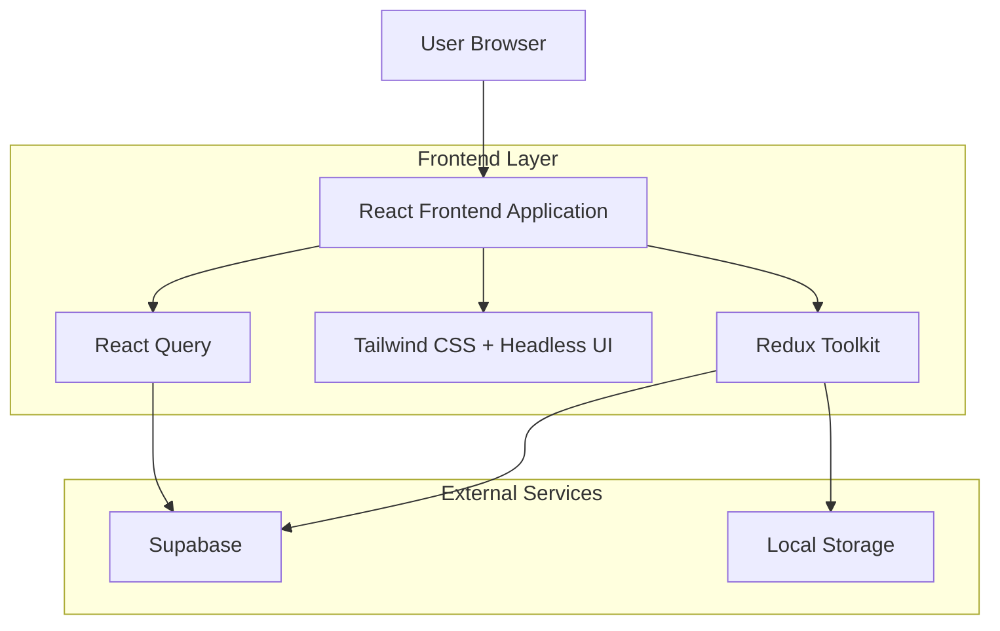
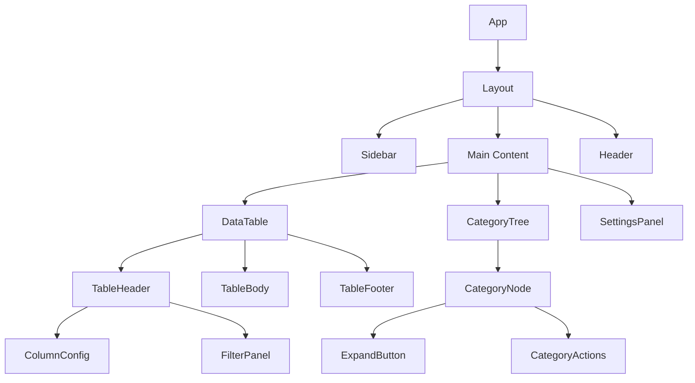
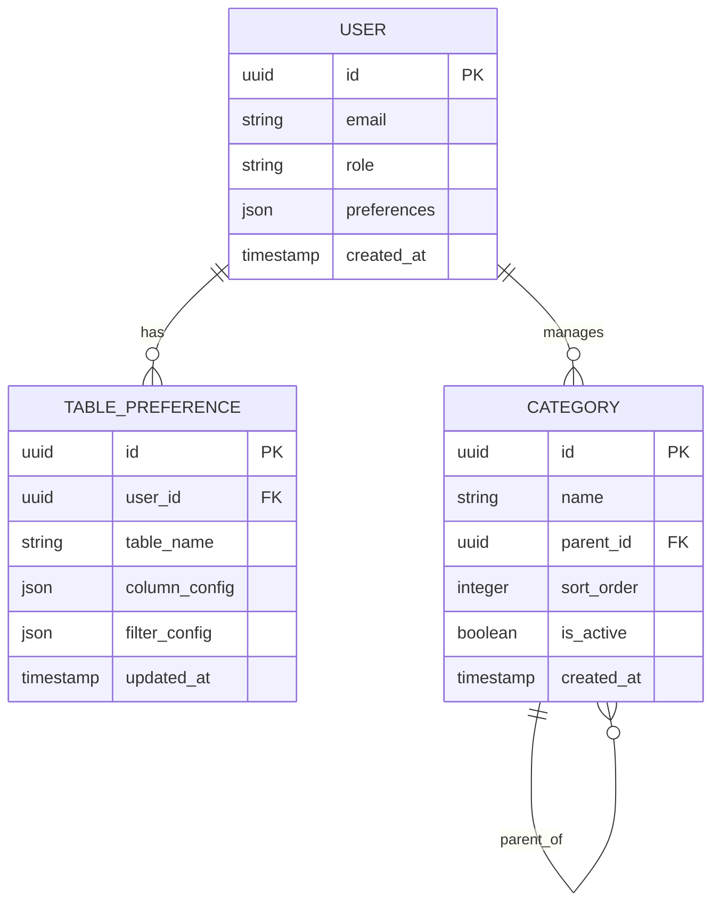

## 1. Architecture Design



## 2. Technology Description
- **Frontend**: React@18 + TypeScript + Tailwind CSS@3
- **Initialization Tool**: vite-init
- **State Management**: Redux Toolkit + RTK Query
- **UI Components**: Headless UI + Custom component library
- **Data Fetching**: React Query for server state management
- **Backend**: Supabase (PostgreSQL + Authentication)
- **Build Tool**: Vite with SWC for fast development

## 3. Route Definitions
| Route | Purpose |
|-------|---------|
| / | Main dashboard with overview and navigation |
| /tables/:tableName | Data table view with configurable columns and filters |
| /categories | Category hierarchy management page |
| /settings | User preferences and table configuration |
| /profile | User profile and account settings |

## 4. Component Architecture

### 4.1 Core Components
```typescript
// Table Configuration Types
interface TableColumn {
  id: string;
  title: string;
  dataIndex: string;
  width?: number;
  visible: boolean;
  sortable: boolean;
  filterable: boolean;
}

interface TableFilter {
  columnId: string;
  operator: 'equals' | 'contains' | 'greater' | 'less';
  value: string | number;
}

interface CategoryNode {
  id: string;
  name: string;
  parentId?: string;
  children: CategoryNode[];
  isExpanded: boolean;
  level: number;
}
```

### 4.2 State Management Structure
```typescript
// Redux Store Structure
interface UIState {
  sidebarCollapsed: boolean;
  theme: 'light' | 'dark';
  fontSize: 'small' | 'medium' | 'large';
}

interface TableState {
  columns: TableColumn[];
  filters: TableFilter[];
  sortConfig: { columnId: string; direction: 'asc' | 'desc' };
  pageSize: number;
  currentPage: number;
}

interface CategoryState {
  categories: CategoryNode[];
  expandedNodes: string[];
  selectedCategory: string | null;
}
```

## 5. Component Hierarchy



## 6. Data Models

### 6.1 Database Schema


### 6.2 Data Definition Language
```sql
-- Users table (Supabase auth)
CREATE TABLE users (
  id UUID PRIMARY KEY DEFAULT gen_random_uuid(),
  email VARCHAR(255) UNIQUE NOT NULL,
  role VARCHAR(50) DEFAULT 'user',
  preferences JSONB DEFAULT '{}',
  created_at TIMESTAMP WITH TIME ZONE DEFAULT NOW()
);

-- Table preferences for column configuration
CREATE TABLE table_preferences (
  id UUID PRIMARY KEY DEFAULT gen_random_uuid(),
  user_id UUID REFERENCES auth.users(id) ON DELETE CASCADE,
  table_name VARCHAR(100) NOT NULL,
  column_config JSONB NOT NULL DEFAULT '[]',
  filter_config JSONB NOT NULL DEFAULT '[]',
  created_at TIMESTAMP WITH TIME ZONE DEFAULT NOW(),
  updated_at TIMESTAMP WITH TIME ZONE DEFAULT NOW(),
  UNIQUE(user_id, table_name)
);

-- Categories with hierarchical structure
CREATE TABLE categories (
  id UUID PRIMARY KEY DEFAULT gen_random_uuid(),
  name VARCHAR(255) NOT NULL,
  parent_id UUID REFERENCES categories(id) ON DELETE CASCADE,
  sort_order INTEGER DEFAULT 0,
  is_active BOOLEAN DEFAULT true,
  metadata JSONB DEFAULT '{}',
  created_at TIMESTAMP WITH TIME ZONE DEFAULT NOW(),
  updated_at TIMESTAMP WITH TIME ZONE DEFAULT NOW()
);

-- Indexes for performance
CREATE INDEX idx_table_preferences_user_id ON table_preferences(user_id);
CREATE INDEX idx_categories_parent_id ON categories(parent_id);
CREATE INDEX idx_categories_active ON categories(is_active) WHERE is_active = true;

-- Row Level Security (RLS) Policies
ALTER TABLE table_preferences ENABLE ROW LEVEL SECURITY;
ALTER TABLE categories ENABLE ROW LEVEL SECURITY;

-- Users can only access their own preferences
CREATE POLICY "Users can view own preferences" ON table_preferences
  FOR SELECT USING (auth.uid() = user_id);

CREATE POLICY "Users can update own preferences" ON table_preferences
  FOR ALL USING (auth.uid() = user_id);

-- Category access policies
CREATE POLICY "Anyone can view active categories" ON categories
  FOR SELECT USING (is_active = true);

CREATE POLICY "Admins can manage categories" ON categories
  FOR ALL USING (EXISTS (
    SELECT 1 FROM users WHERE id = auth.uid() AND role = 'admin'
  ));
```

## 6. API Integration Patterns

### 6.1 React Query Hooks
```typescript
// Custom hooks for data fetching
export const useTableData = (tableName: string, filters: TableFilter[]) => {
  return useQuery({
    queryKey: ['table', tableName, filters],
    queryFn: () => fetchTableData(tableName, filters),
    staleTime: 5 * 60 * 1000, // 5 minutes
  });
};

export const useCategories = () => {
  return useQuery({
    queryKey: ['categories'],
    queryFn: fetchCategories,
    staleTime: 10 * 60 * 1000, // 10 minutes
  });
};
```

### 6.2 Supabase Integration
```typescript
// Supabase client configuration
import { createClient } from '@supabase/supabase-js'

const supabase = createClient(
  import.meta.env.VITE_SUPABASE_URL,
  import.meta.env.VITE_SUPABASE_ANON_KEY
)

// Real-time subscriptions for category updates
export const subscribeToCategories = (callback: (categories: CategoryNode[]) => void) => {
  return supabase
    .from('categories')
    .on('*', payload => {
      callback(payload.new as CategoryNode[])
    })
    .subscribe()
}
```

## 7. Performance Optimization

### 7.1 Virtual Scrolling for Large Tables
- Implement react-window for table virtualization
- Load data in chunks with pagination
- Memoize expensive computations with useMemo

### 7.2 Category Tree Optimization
- Lazy load child categories on expand
- Implement efficient tree traversal algorithms
- Cache expanded state in localStorage

### 7.3 Bundle Size Optimization
- Code splitting for route-based components
- Tree shaking for unused code elimination
- Dynamic imports for heavy components